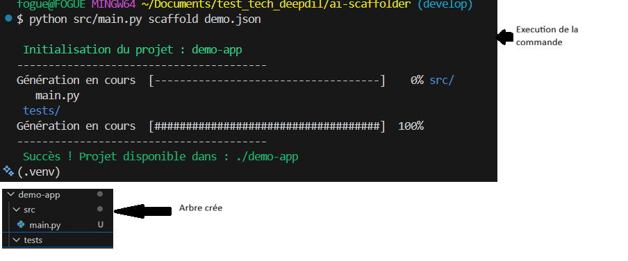
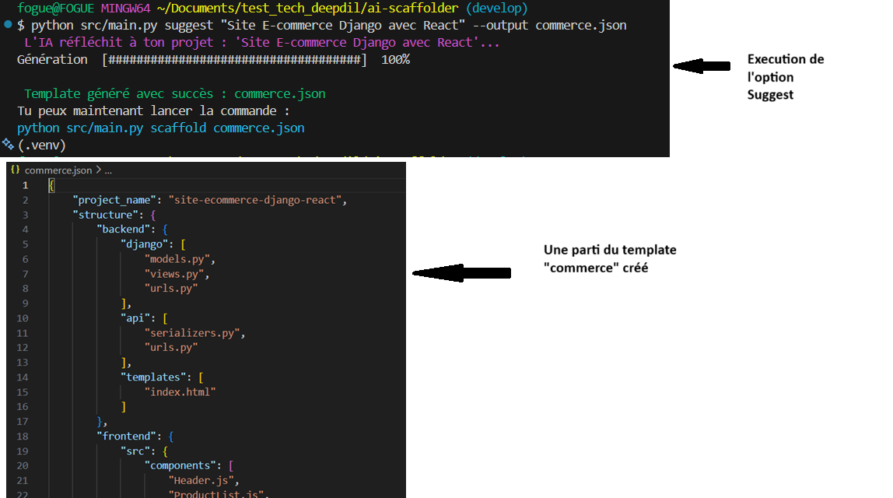
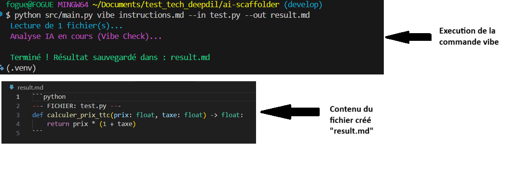

# THE AI SCAFFOLDER

**The AI Scaffolder** est un outil CLI (Command Line Interface) développé en Python. Il permet l'automatisation de la création d'architectures logicielles et le refactoring assisté par l'IA (OpenAI API).


---

## 1. Fonctionnalités Implémentées

Le projet répond aux trois exigences du test technique :

### A. Moteur de Scaffolding (Core)
Génération récursive de dossiers et fichiers basée sur une définition JSON stricte.
*Commande :* `python src/main.py scaffold template.json`



### B. Génération de Template (Module IA)
Traduction d'une spécification fonctionnelle en fichier de configuration technique JSON via LLM.
*Commande :* `python src/main.py suggest "Description du projet" --output config.json`



### C. Pipeline de Modification (Vibe Coding)
Analyse contextuelle de fichiers sources et application de transformations (Refactoring, Documentation) selon des instructions fournies.
*Commande :* `python src/main.py vibe instructions.md --in fichier.py --out rapport.md`



---

## 2. Organisation du Code Source

L'architecture du projet respecte la séparation des responsabilités (Logique Métier vs Interface CLI).

| Chemin | Type | Description Technique |
| :--- | :--- | :--- |
| `src/main.py` | **Point d'Entrée** | Interface CLI gérée avec `Typer`. Orchestre les commandes et gère les E/S fichiers. |
| `src/ai.py` | **Module Logique** | Encapsulation de l'API OpenAI. Contient les "System Prompts" et la gestion des erreurs API. |
| `ai-meta/` | **Documentation** | Trace des prompts utilisés pour instruire l'IA. |
| `assets/` | **Ressources** | Captures d'écran et éléments visuels pour le rapport de fonctionnement. |
| `template.json` | **Configuration** | Modèle de référence pour la structure des projets générés. |
| `.env` | **Sécurité** | Fichier de configuration locale pour la clé API (exclu du versionning Git, car contient ma clé d'API privé). |
| `requirements.txt` | **Dépendances** | Liste des librairies Python requises (`typer`, `openai`, `python-dotenv`). |

---

## 3. Guide d'Installation

Environnement requis : Python 3.8+

1.  **Clonage du dépôt :**
    ```bash
    git clone [https://github.com/VOTRE_PSEUDO/ai-scaffolder.git](https://github.com/VOTRE_PSEUDO/ai-scaffolder.git)
    cd ai-scaffolder
    ```

2.  **Installation des dépendances :**
    ```bash
    python -m venv .venv
    # Windows : .venv\Scripts\activate
    # Mac/Linux : source .venv/bin/activate
    pip install -r requirements.txt
    ```

3.  **Configuration API :**
    Créer un fichier `.env` à la racine :
    ```env
    OPENAI_API_KEY=sk-votre-cle-api
    ```
    *(Note : Un mode simulation "Mock" s'active automatiquement si aucune clé n'est détectée).*

---

**Auteur :** Rayan FOGUE
*Rendu de Test Technique - Janvier 2026*